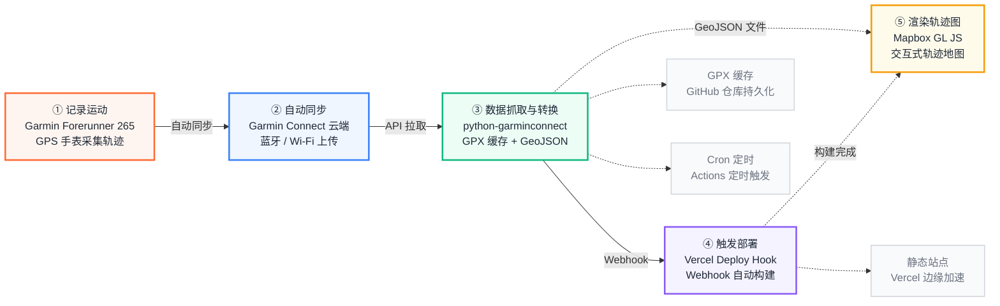

### 跑步

运动也是我大学毕业后，为数不多真正坚持下来的事。有时会去游泳，有时会去健身房，但更多的时候还是在跑步。

跑步是我启动成本最低的运动：没有游泳的装备与车程，没有健身房的距离与排队。它的全部准备，就是出门。

跑步也是我逃离成本最低的运动：迈步向前的时候，工作微信的未读红点、社交媒体的信息流、城市的嘈杂噪音，全部被隔绝在外。那一刻，世界只剩下自己的节拍与心跳，脚下是绵延的路，抬头是璀璨的星空。

泳池、跑道、健身房，换着地方与自己相处。或许因外派工作或出差，让工作填满日程的每一处缝隙。但即使游历在外，我依然会在临时的落脚点周围寻找可以锻炼的场所。四年来，我的体重也从大学毕业时的 87kg 慢慢降低到现在 72kg 左右。在这个充满不确定性，个人意志常被洪流裹挟稀释而显得微不足道的时代，那些在汗水与喘息中一点点消减的脂肪、逐渐清晰的线条，是我唯一能够主动选择并兑现的改变。

### Forerunner 265

今年年中时，陪伴我四年的红米手表终于「寿终正寝」——心率监测失灵，数字表冠也频频卡顿。换表提上日程，我最终选择了 Garmin Forerunner 265。

下单前其实犹豫过。毕竟是全塑料机身，总担心质感廉价、戴着像儿童玩具，还专门跑到南宁万象城的专柜试戴了一圈，确认自己能接受这个质感。才在淘宝上叠加国补，1699 元拿下。

在下定决心选择佳明之前，我是一直想购买一块 Apple Watch 的，作为一块真正意义上的「智能」手表，它的功能丰富度确实碾压佳明、高驰这类专业运动表，也远非小米 RTOS 系统的「半智能」手表可比。但功能堆砌的代价同样明显：24 小时续航、运动时 5 秒一次的心率采样，以及更高的售价，更重的机身。

更重要的是，我反复问自己：我真的需要一块「智能手表」吗？需要把消息源源不断地投射到手腕上吗？需要在手表上下载各种 App 吗？

过去四年，「手表提醒手机通知」这一功能，给我留下最深刻的印象不是便利，而是困扰。当午休时手机自动开启勿扰模式，手表却不同步状态，熟睡中屡屡被震动惊醒。后来我索性常年把手表设为勿扰。对我而言，手表不需要「智能」，也绝非在手腕上再复刻一台手机，当 Apple Watch 的核心卖点恰恰是我最不需要的东西时，选择便不再困难。

在运动手表的序列中，我主要纠结的选择是高驰和佳明。最后因为在 Github 上看到了比较多关于佳明手表数据二次利用的仓库，就决定选择佳明的设备。

在佳明手表的序列中，Forerunner 是专为跑步设计的系列，而其中 255/265/570 系列为进阶跑者设计，965/970 系列则针对越野跑、铁三运动优化，增加了表端地图导航的功能。9 系的地图导航固然有用，但是我暂时还没有尝试过越野跑，也暂时不想为这个功能付出超过 3000 元的价格。

255/265/570 这几款中，255 采用了强光下更清晰的 MIP 半反半透屏幕，265 和 570 采用了室内和夜间显示效果更好的 AMOLED 屏幕，并带有音乐播放功能。而 570 升级了佳明第五代光学心率传感器（但相比 9 系阉割了皮肤温度检测）以及铝合金表圈。。因为我已经配备了心率带，所以心率传感器的代差对我而言不是问题。

### 关于这个页面

在看到 [yihong0618/running_page](https://github.com/yihong0618/running_page) 这个项目后，我也决定构建一个属于自己的运动地图。但是 running_page 这个项目采用了较重的后端技术，需要额外维护数据库，所以我决定基于我的网站的技术栈重新开发。

日常使用 Garmin Forerunner 265 记录运动数据，经云同步到 Garmin Connect CN 后，使用 Github Actions 调用 [python-garminconnect](https://github.com/cyberjunky/python-garminconnect)，定时将运动的 GPX 文件增量拉取到仓库，并生成记录运动基础数据的 json 文件和描述运动路径的 Geojson 文件，并将结果持久化到 Git 仓库。

随后 Github Actions 触发站点的 Vercel Deploy Hook，在自动构建的过程中，从 Git 仓库拉取 json 和 Geojson 文件，并使用 Mapbox JS 渲染运动路径。

